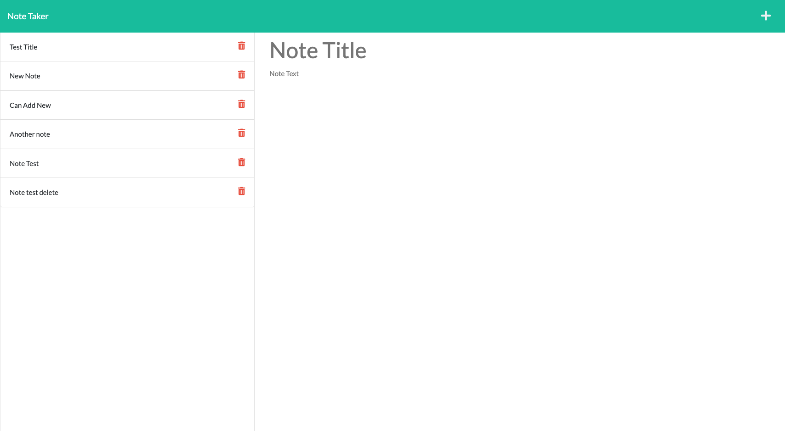

# Note Taker

## Description 

- A note taking application that allows a user to write, save, read, and delete their notes. 
- This application features a dynamic, one-page design that can store notes in the sites database. 

## Criteria and Technologies Employed 

- Given the applications front end, I was tasked with creating a server configuration file, routes (utilizing express), database creation (express --> array of object from a JSON file), and finally connecting these to the existing front end. 

- Application utilized express for routing. 

- Utilities such as fs were imperative for writing and reading files.

## Screenshots 

## Live Heroku Deployed Link

[Heroku-Live-Link](https://notetakerbrandt.herokuapp.com/)

## Contact and Contributions 

[GithubProfile](https://github.com/BrandtDavidson)